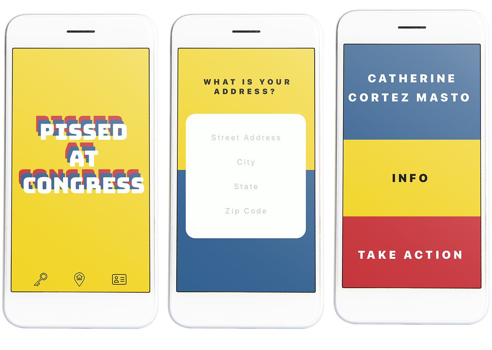

# Pissed At Congress

<p align="center">
  
</p>

Pissed At Congress is a mobile app to help people find and contact members of the United States Congress.

Here are the problems that the app aims to solve:

1. A lot of people don't know who their congressmembers are.
2. A lot of people don't realize that they can directly contact their elected leaders -- about anything!
3. A lot of people are just pissed at Congress and politicans in general.

What the app can do:

1. Users can find their elected leaders with their home address.
2. Users can also search for a congressmember by name.
3. Users can get more information about a congressmember (state, election information, contact information).
4. Users can call their congressmember directly on their phone - to complain about anything!

<p align="center">
  
</p>

<p align="center">
  
</p>

<p align="center">
  
</p>

## Getting started

1. Install the React Native Expo development environment
[Expo XDE](https://www.expo.io)
```bash
npm install -g exp
```

2. Clone this repo
```bash
git clone https://github.com/ommwong/pissed-at-congress.git
```

3. Install the dependencies
```bash
npm install
```

4. Start the development server
```bash
npm start
```

5. Scan the barcode on the Expo app on your phone

## Built with
* [React Native](https://facebook.github.io/react-native/) - Front end library for mobile UIs
* [Expo](https://expo.io/) - Cross-platform ios and Android apps
* [React Navigation](https://reactnavigation.org/) - Routing and navigation for React Native apps
* Other dependencies:
  * [ProPublica Congress API](https://projects.propublica.org/api-docs/congress-api/)
  * [Google Civic Information API](https://developers.google.com/civic-information)
* Lots of blood, sweat, and tears 😅💃🏻

## Made by
Mo Wong - [Github](https://github.com/ommwong) - [LinkedIn](https://www.linkedin.com/in/mowong1/)

