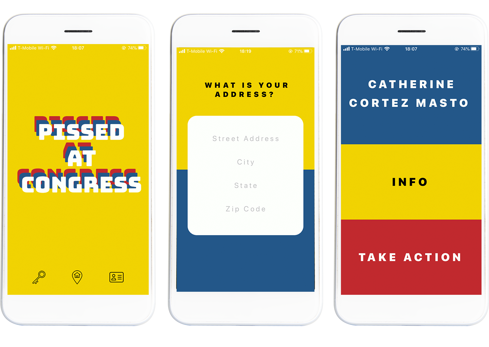

# Pissed At Congress

  

Pissed At Congress is a mobile (iOS) app to help people find and contact members of the United States Congress.

Here are the problems that the app aims to solve:

1. A lot of people don't know who their congressmembers are.
2. A lot of people don't realize that they can directly contact their elected leaders -- about anything!
3. A lot of people are just pissed at Congress.

What the app can do:

1. Users can find their elected leaders with their home address.
2. Users can also search for a congressmember by name.
3. Users can get more information about a congressmember (state, election information, contact information).
4. Users can call their congressmember directly on their phone.

  

## Getting started